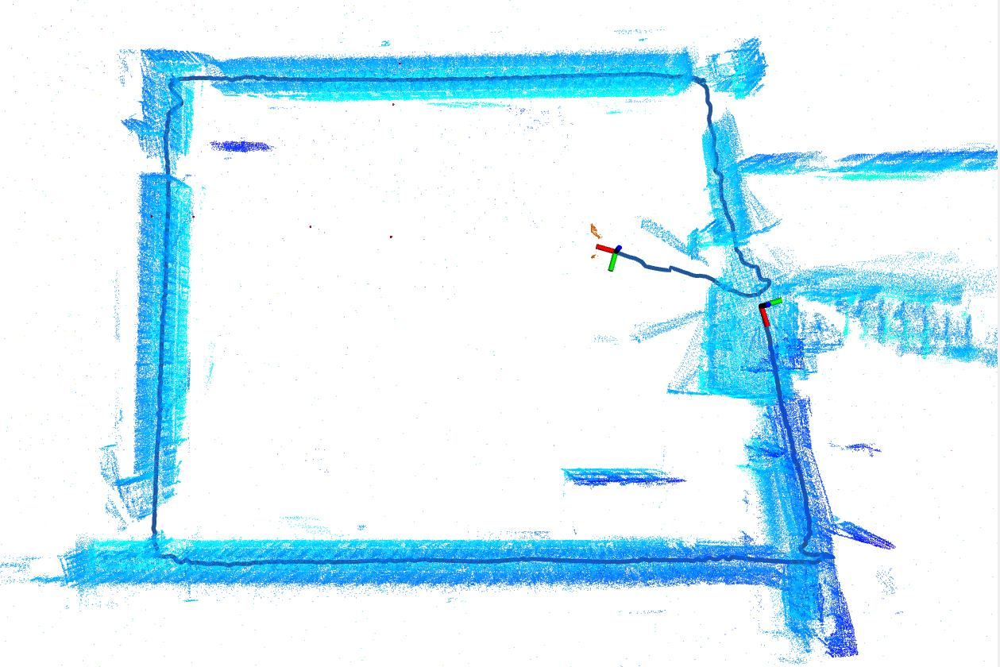
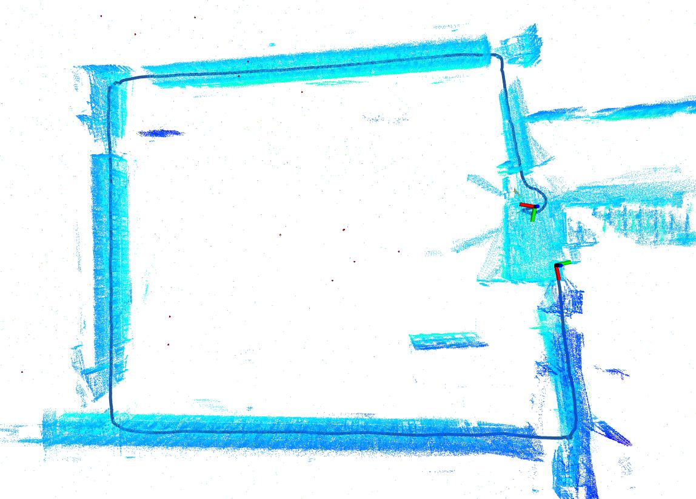

# LIO-EKF 改进版：添加轮速观测


## 🔍 核心改进：轮速信息对轨迹精度的影响
我们在[M3DGR数据集](https://github.com/sjtuyinjie/M3DGR.git)上验证了**融合轮速信息**对定位与建图的关键作用。以下是未加入轮速 vs 加入轮速的轨迹对比：

<div style="display: flex; justify-content: space-around; margin: 20px 0;">
  
  
</div>

**结论**：融合轮速信息后，在转弯处及雷达特征较少区域，对估计抖动产生了明显的抑制。


<p align="center">

  <h1 align="center">LIO-EKF: High Frequency LiDAR-Inertial Odometry using Extended Kalman Filters</h1>

  <p align="center">
    <a href="https://arxiv.org/pdf/2311.09887">.svg?style=flat-square" /></a>
    <a href="https://github.com/YibinWu/LIO-EKF"></a> 
    <a href="https://github.com/YibinWu/LIO-EKF/blob/main/LICENSE"></a> 
    
  </p>

</p>

**TL;DR: LIO-EKF is a lightweight yet efficient LiDAR-inertial odometry system based on adaptive point-to-point registration and EKF.**

[](https://youtu.be/MoJTqEYl1ME "")


## 1. Prerequisites
* Ubuntu OS (tested on 20.04)
* ROS 

  Follow [ROS Noetic installation instructions for Ubuntu 20.04](http://wiki.ros.org/noetic/Installation/Ubuntu).

* [Eigen 3.4](https://eigen.tuxfamily.org/index.php?title=Main_Page)

## 2. RUN LIO-EKF

### 2.1 Clone the repository and catkin_make
```
cd ~/catkin_ws/src
git clone git@github.com:YibinWu/LIO-EKF.git
cd ../
catkin_make
source ~/catkin_ws/devel/setup.bash
```

### 2.2 Download the datasets
* [urbanNav](https://github.com/IPNL-POLYU/UrbanNavDataset)
* [m2dgr](https://github.com/SJTU-ViSYS/M2DGR)
* [newerCollege](https://ori-drs.github.io/newer-college-dataset/stereo-cam/)

### 2.3 Run it

Replace the path to the rosbag (***bagfile***) in the launch files with your own path.
```
roslaunch lio_ekf urbanNav20210517.launch 
roslaunch lio_ekf street_01.launch
roslaunch lio_ekf short_exp.launch 
```

## 3. Citation

If you find our study helpful to your academic work, please consider citing the paper.

```bibtex
@inproceedings{wu2024icra,
    author     = {Wu, Yibin and Guadagnino, Tiziano and Wiesmann, Louis and Klingbeil, Lasse and Stachniss, Cyrill and Kuhlmann, Heiner},
    title      = {{LIO-EKF}: High Frequency {LiDAR}-Inertial Odometry using Extended {Kalman} Filters},
    booktitle  = {IEEE International Conference on Robotics and Automation (ICRA)},
    year       = {2024}
}
```

## 4. Contact
If you have any questions, please feel free to contact Mr. Yibin Wu {[yibin.wu@igg.uni-bonn.de]()}.


## 5. Acknowledgement
Thanks a lot to [KISS-ICP](https://github.com/PRBonn/kiss-icp), which has inspired this work, and [KF-GINS](https://github.com/i2Nav-WHU/KF-GINS).
